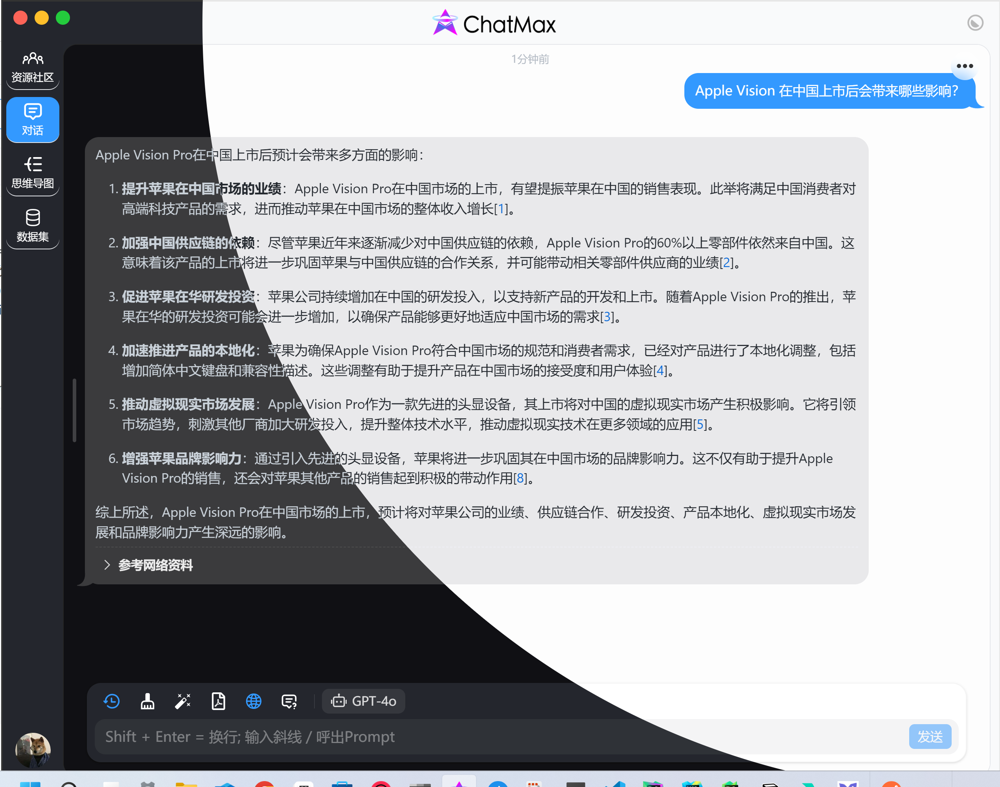
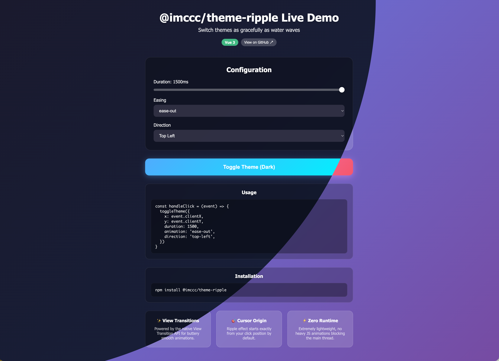

# theme-ripple

[](https://www.npmjs.com/package/@imccc/theme-ripple)
[](https://opensource.org/licenses/MIT)
[](https://theme-ripple.imccc.dev)

Smooth theme transitions for **Vue** and **React** using the [View Transition API](https://developer.mozilla.org/en-US/docs/Web/API/View_Transitions_API).




## ✨ Features

- 🎨 **Smooth Animations** - Beautiful circular/directional transitions powered by View Transition API
- ⚛️ **Vue & React** - First-class support for both frameworks
- 🧭 **8 Directions** - Animate from any edge or corner
- 🎛️ **Customizable** - Control duration, easing, and animation origin
- 🌐 **System Theme** - Auto-detect and sync with OS theme preference
- 📦 **Lightweight** - No dependencies, tree-shakeable

## 📦 Installation

```bash
# npm
npm install @imccc/theme-ripple

# pnpm
pnpm add @imccc/theme-ripple

# yarn
yarn add @imccc/theme-ripple
```

## 🚀 Quick Start

### Vue

```vue
<script setup lang="ts">
import { ref } from 'vue'
import { useThemeRipple } from '@imccc/theme-ripple/vue'

const isDark = ref(false)

const { toggleTheme, isTransitioning, isSupported } = useThemeRipple(
  isDark,
  (dark) => {
    isDark.value = dark
    document.documentElement.classList.toggle('dark', dark)
  },
  true // sync with system theme
)

const handleClick = (event: MouseEvent) => {
  toggleTheme({
    x: event.clientX,
    y: event.clientY,
    duration: 400,
    animation: 'ease-out'
  })
}
</script>

<template>
  <button @click="handleClick" :disabled="isTransitioning">
    Toggle Theme {{ isSupported ? '(Animated)' : '(Instant)' }}
  </button>
</template>
```

### React

```tsx
import { useState, useCallback } from 'react'
import { useThemeRipple } from '@imccc/theme-ripple/react'

function App() {
  const [isDark, setIsDarkState] = useState(false)

  const setIsDark = useCallback((dark: boolean) => {
    setIsDarkState(dark)
    document.documentElement.classList.toggle('dark', dark)
  }, [])

  const { toggleTheme, isTransitioning, isSupported } = useThemeRipple(isDark, setIsDark, true)

  const handleClick = (event: React.MouseEvent) => {
    toggleTheme({
      x: event.clientX,
      y: event.clientY,
      duration: 400,
      animation: 'ease-out'
    })
  }

  return (
    <button onClick={handleClick} disabled={isTransitioning}>
      Toggle Theme {isSupported ? '(Animated)' : '(Instant)'}
    </button>
  )
}
```

## 📖 API Reference

### `useThemeRipple(isDark, setIsDark, isAutoChangeTheme?)`

| Parameter | Type | Description |
|-----------|------|-------------|
| `isDark` | `Ref<boolean>` (Vue) / `boolean` (React) | Current dark mode state |
| `setIsDark` | `(dark: boolean) => void` | Function to update dark mode state |
| `isAutoChangeTheme` | `boolean` | Auto-sync with system theme (default: `true`) |

**Returns:**

| Property | Type | Description |
|----------|------|-------------|
| `toggleTheme` | `(options) => void` | Function to trigger theme transition |
| `isTransitioning` | `Ref<boolean>` (Vue) / `boolean` (React) | Whether a transition is in progress |
| `isSupported` | `Ref<boolean>` (Vue) / `boolean` (React) | Whether the browser supports View Transition API |

### `toggleTheme(options)`

| Option | Type | Default | Description |
|--------|------|---------|-------------|
| `x` | `number` | - | X coordinate of animation origin |
| `y` | `number` | - | Y coordinate of animation origin |
| `duration` | `number` | `400` | Animation duration in ms |
| `animation` | `string` | `'ease-in'` | CSS easing function |
| `direction` | `Direction` | - | Preset direction (overrides x/y) |
<!-- | `borderRadius` | `number` | - | Use rounded rectangle instead of circle | -->

### Direction Options

| Value | Description |
|-------|-------------|
| `'top'` | Expand from top center |
| `'bottom'` | Expand from bottom center |
| `'left'` | Expand from left center |
| `'right'` | Expand from right center |
| `'top-left'` | Expand from top-left corner |
| `'top-right'` | Expand from top-right corner |
| `'bottom-left'` | Expand from bottom-left corner |
| `'bottom-right'` | Expand from bottom-right corner |

## 🌐 Browser Support

This library uses the [View Transition API](https://caniuse.com/view-transitions). For unsupported browsers, the theme will change immediately without animation.

## 📄 License

[MIT](LICENSE) © [ImChrisChen](https://github.com/ImChrisChen)
